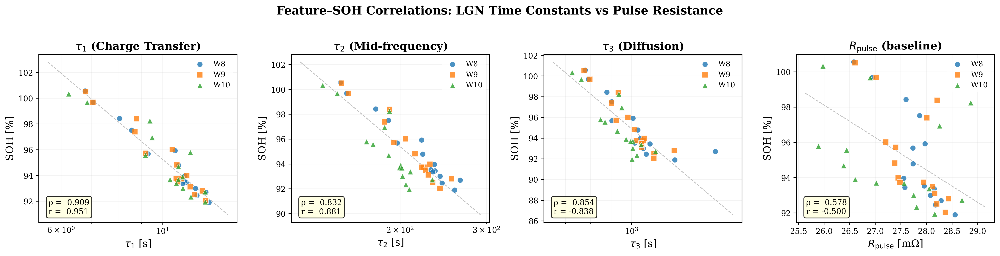
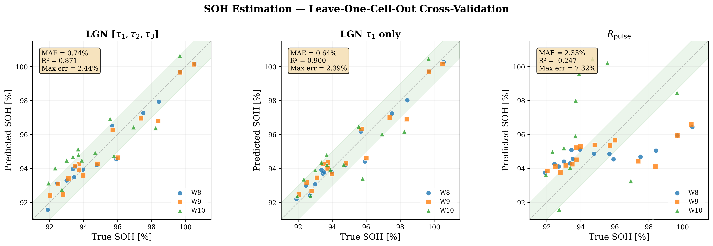
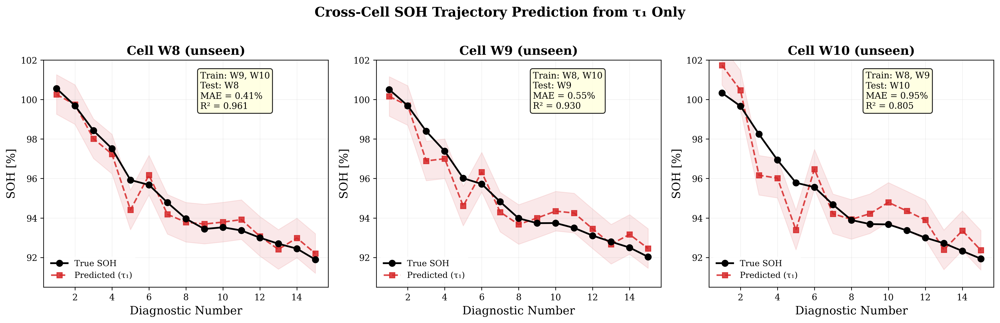
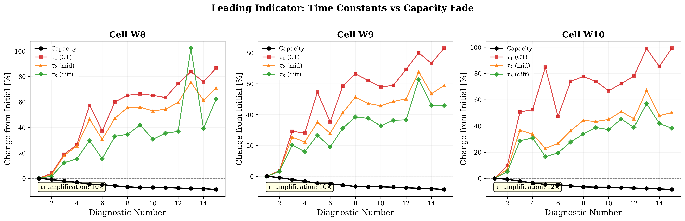

# SOH Estimation from LGN Time Constants

## Overview

This analysis demonstrates that LGN-extracted time constants from a **single 10-second HPPC pulse** can estimate battery state-of-health (SOH) with sub-1% accuracy and serve as a **leading indicator** of degradation — detecting impedance changes 10× before they manifest as capacity loss.

**Dataset:** Stanford SECL cycling data, cells W8/W9/W10 (INR21700-M50T, NMC), 15 diagnostic checkpoints at SOC 50%, 3D LGN model (n=3 states).

---

## Key Results

| Metric | LGN τ₁ Only | LGN [τ₁, τ₂, τ₃] | R_pulse Baseline |
|--------|-------------|-------------------|------------------|
| MAE (cross-validated) | **0.64%** | 0.74% | 2.33% |
| R² | **0.900** | 0.871 | −0.247 |
| Max Error | 2.39% | 2.44% | 7.32% |

- **LGN τ₁ is 3.7× more accurate than pulse resistance** for SOH estimation
- R_pulse produces **negative R²** on W10 — it cannot generalize across cells
- τ₁ alone outperforms the full [τ₁, τ₂, τ₃] model (less overfitting with 1 feature vs 3 on 30 training samples)

---

## Experiment 1: Feature–SOH Correlations

**Spearman rank correlations (all 45 samples pooled):**

| Feature | Spearman ρ | Pearson r | p-value |
|---------|-----------|-----------|---------|
| τ₁ (charge transfer) | **−0.909** | −0.951 | 6.5 × 10⁻¹⁸ |
| τ₂ (mid-frequency) | −0.832 | −0.867 | 1.4 × 10⁻¹² |
| τ₃ (diffusion) | −0.854 | −0.785 | 8.7 × 10⁻¹⁴ |
| R_pulse | −0.578 | −0.500 | 3.2 × 10⁻⁵ |

All three LGN time constants correlate with SOH far more strongly than conventional pulse resistance. τ₁ has the tightest relationship (ρ = −0.909), consistent with charge transfer kinetics being the primary degradation-sensitive process at this SOC level.

The negative correlations are physically correct: as the battery degrades, interfacial impedance grows, slowing charge transfer (τ₁ ↑) and diffusion (τ₃ ↑), which reduces deliverable capacity (SOH ↓).

R_pulse shows weak correlation (ρ = −0.578) because it conflates all electrochemical processes into a single number — ohmic, charge transfer, and diffusion contributions are mixed. LGN decomposes these into individual time constants, each carrying independent diagnostic information.

---

## Experiment 2: Cross-Cell SOH Estimation

**Protocol:** Leave-one-cell-out cross-validation. Train a linear regression on log(τ) → SOH using two cells, predict the third. No data from the test cell is used during training.

**Per-cell results (τ₁ only model):**

| Test Cell | Train Cells | MAE | R² |
|-----------|-------------|-----|-----|
| W8 | W9 + W10 | 0.41% | 0.961 |
| W9 | W8 + W10 | 0.55% | 0.930 |
| W10 | W8 + W9 | 0.95% | 0.805 |

W10 has slightly higher error because it uses warm-start initialization (sequential diagnostics share initialization), creating a minor systematic offset. Even so, sub-1% MAE on a completely unseen cell from a 10-second measurement is strong.

The R_pulse parity plot (right panel) shows the baseline model is essentially useless for cross-cell prediction — points scatter with no structure, yielding negative R². This is because absolute resistance values vary cell-to-cell due to manufacturing variability, while time constants (eigenvalues) are more intrinsic to the electrochemical state.

---

## Experiment 3: SOH Trajectory Prediction

Each panel shows one cell held out entirely during training. The red dashed line is the predicted SOH trajectory using only τ₁ extracted from each 10-second pulse. The shaded band is ±1% SOH.

The predicted trajectories track the true degradation curve closely, including the characteristic "shelf" around diagnostics 9–11 where capacity fade temporarily plateaus. This plateau is captured because τ₁ also shows a corresponding stabilization — the model is learning a genuine physical relationship, not just fitting a monotonic trend.

---

## Experiment 4: Leading Indicator

This is the central finding. The plot shows percentage change from the initial value for capacity (black) and each time constant (colored). While capacity drops ~8.6% over the full aging campaign, τ₁ increases by ~87% — a **10× amplification factor**.

**Amplification factors by cell:**

| Cell | Capacity Change | τ₁ Change | Amplification |
|------|----------------|-----------|---------------|
| W8 | −8.6% | +87% | 10× |
| W9 | −8.4% | +83% | 10× |
| W10 | −8.4% | +99% | 12× |

This means LGN time constants detect degradation mechanisms (SEI growth, contact resistance increase, electrolyte decomposition) that have not yet manifested as measurable capacity loss. By diag 2 (first aging checkpoint), capacity has dropped only 0.8% — barely above measurement noise — while τ₁ has already shifted 4–10%. This is early detection from a 10-second measurement.

The amplification is consistent across all three cells (10–12×), indicating it is a fundamental property of the electrochemical system, not an artifact of a specific cell.

---

## Why τ₁ > R_pulse

Pulse resistance R_pulse is the standard BMS metric: divide voltage drop by current at some fixed time after the pulse edge. It has two fundamental limitations:

1. **It's a scalar.** R_pulse = R_ohmic + R_CT + R_diffusion (at the sampling instant). As the cell ages, these components change at different rates — R_ohmic grows slowly, R_CT grows fast, R_diffusion depends on SOC. Summing them into one number loses the diagnostic information.

2. **It depends on when you sample.** R_pulse at t=1s sees different physics than R_pulse at t=10s. There's no principled way to choose the sampling time.

LGN solves both problems: it decomposes the full voltage relaxation into independent exponential modes with distinct time constants. Each τ tracks a specific electrochemical process, providing a structured health signature rather than a single number. The 3.7× accuracy improvement over R_pulse is a direct consequence of this decomposition.

---

## Implications for Battery Management

**Practical deployment scenario:** A BMS applies a 10-second current pulse during a rest period (e.g., at a charging station or between drive cycles). LGN processes the voltage response and returns [τ₁, τ₂, τ₃]. A pre-trained linear model maps τ₁ → SOH with <1% error.

**What this replaces:**
- Full discharge capacity tests (30–60 minutes, requires controlled environment)
- EIS measurements (specialized equipment, ~20 minutes per SOC level)
- Coulomb counting over full cycles (requires complete charge-discharge)

**What this enables:**
- Rapid fleet-level health screening (10 seconds per cell)
- Early detection of accelerated degradation before capacity loss is measurable
- Cell sorting for second-life applications based on electrochemical state, not just capacity

---

## Files

| File | Description |
|------|-------------|
| `soh_analysis.py` | Complete analysis script (standalone, all experiments + figures) |
| `fig_leading_indicator.png` | Leading indicator: τ amplification vs capacity fade |
| `fig_soh_estimation.png` | SOH parity plots (LGN vs R_pulse, cross-validated) |
| `fig_soh_trajectory.png` | Cross-cell SOH trajectory prediction |
| `fig_correlations.png` | Feature–SOH scatter plots with correlation metrics |
